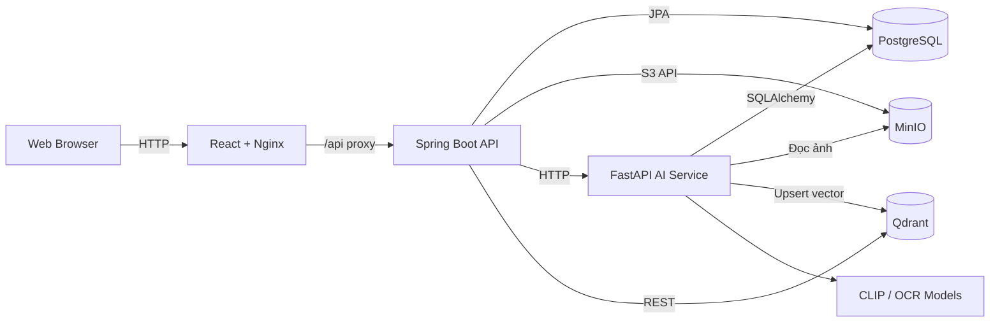
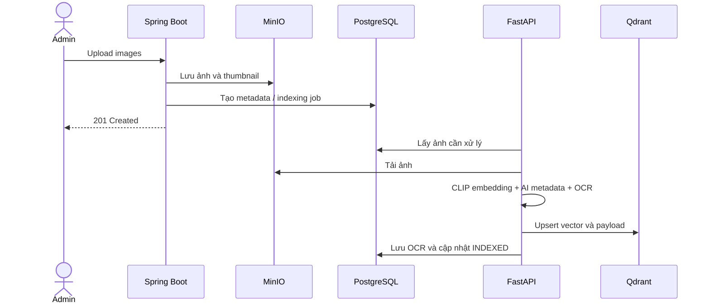
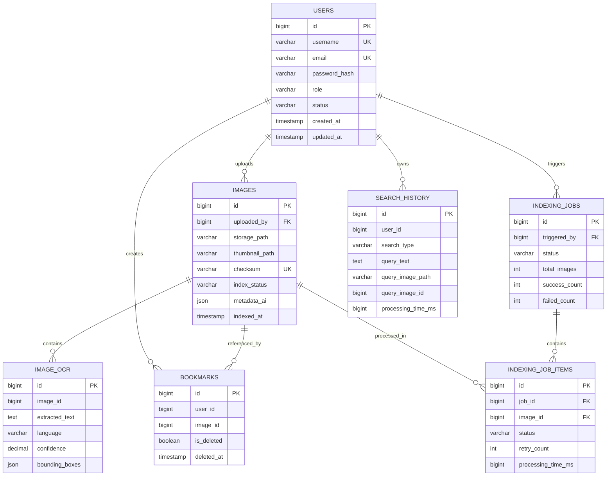

# Visual Search Engine

Visual Search Engine là nền tảng tìm kiếm hình ảnh đa phương thức, cho phép người dùng tìm kiếm bằng hình ảnh, mô tả văn bản hoặc nội dung chữ xuất hiện trong ảnh. Hệ thống kết hợp mô hình CLIP, OCR, cơ sở dữ liệu vector và kho lưu trữ đối tượng để cung cấp kết quả tìm kiếm theo độ tương đồng.

Repository được tổ chức theo mô hình monorepo, gồm giao diện React, API nghiệp vụ Spring Boot, dịch vụ AI FastAPI và toàn bộ hạ tầng cần thiết để chạy hệ thống bằng Docker Compose.

## 1. Tổng quan hệ thống

Hệ thống giải quyết ba bài toán tìm kiếm chính:

- **Image-to-image:** sử dụng một ảnh tải lên hoặc ảnh đã được lập chỉ mục để tìm các ảnh tương đồng về mặt thị giác.
- **Text semantic search:** chuyển mô tả văn bản thành vector và tìm ảnh có nội dung ngữ nghĩa gần nhất.
- **OCR search:** tìm ảnh dựa trên phần văn bản đã được nhận diện và lưu trong PostgreSQL.

Spring Boot là API gateway và tầng nghiệp vụ trung tâm. Dịch vụ này quản lý người dùng, phân quyền, ảnh, lịch sử, bookmark và điều phối tìm kiếm. FastAPI chịu trách nhiệm xử lý AI như sinh embedding, nhận diện văn bản và lập chỉ mục. Dữ liệu được phân bổ theo đúng đặc tính của từng loại:

- PostgreSQL lưu dữ liệu nghiệp vụ và metadata.
- MinIO lưu ảnh gốc và thumbnail.
- Qdrant lưu vector embedding cùng payload phục vụ tìm kiếm.

## 2. Tính năng chính

### Người dùng và bảo mật

- Đăng ký, đăng nhập và xem thông tin tài khoản hiện tại.
- Xác thực stateless bằng JWT access token.
- Làm mới phiên đăng nhập bằng refresh token trong HttpOnly cookie.
- Đổi mật khẩu và đăng xuất.
- Phân quyền `USER` và `ADMIN`; quản lý trạng thái `ACTIVE`, `INACTIVE`, `BLOCKED`.

### Tìm kiếm hình ảnh

- Tìm ảnh tương đồng từ file ảnh do người dùng tải lên.
- Tìm ảnh tương đồng từ một `imageId` đã được lập chỉ mục.
- Tìm bằng mô tả văn bản theo ngữ nghĩa.
- Tìm theo nội dung chữ được OCR từ ảnh.
- Phân trang, giới hạn số lượng kết quả và trả về similarity score.
- Ghi nhận loại truy vấn và thời gian xử lý vào lịch sử tìm kiếm.

### Quản lý ảnh và indexing

- Upload một hoặc nhiều ảnh lên MinIO.
- Sinh thumbnail, checksum và metadata của ảnh.
- Sinh embedding CLIP theo batch và lưu vector vào Qdrant.
- Tự động gắn metadata AI vào payload của vector.
- Theo dõi trạng thái ảnh: `PENDING`, `PROCESSING`, `INDEXED`, `FAILED`, `DELETED`.
- Quản trị indexing job, theo dõi từng item, retry, hủy hoặc xóa tác vụ.

### OCR, lịch sử và bookmark

- Nhận diện nội dung văn bản, ngôn ngữ, confidence và bounding box.
- Xem chi tiết hoặc xóa một/toàn bộ lịch sử tìm kiếm.
- Lưu ảnh vào bookmark, soft delete, khôi phục hoặc xóa vĩnh viễn.
- Tự động dọn dẹp bookmark đã xóa theo lịch cấu hình.

### Quản trị

- Xem thống kê hệ thống.
- Xem danh sách người dùng theo trang, vai trò và trạng thái.
- Upload tập ảnh và điều khiển vòng đời indexing job.

## 3. Kiến trúc hệ thống

### 3.1. Sơ đồ tổng thể



| Thành phần | Công nghệ | Trách nhiệm | Cổng |
| --- | --- | --- | --- |
| Frontend | React 19, Vite, Nginx | Giao diện, routing và gọi API | `3000` |
| Business API | Java 21, Spring Boot 4 | Nghiệp vụ, xác thực, phân quyền và điều phối | `8080` |
| AI Service | FastAPI, OpenCLIP, EasyOCR | Embedding, OCR, indexing nền | `8000` |
| Relational DB | PostgreSQL 16 | Người dùng, ảnh, lịch sử, bookmark và job | `5432` |
| Vector DB | Qdrant | Vector 512 chiều và truy vấn cosine similarity | `6333`, `6334` |
| Object Storage | MinIO | Ảnh gốc và thumbnail | `9000`, `9001` |

### 3.2. Luồng upload và indexing



FastAPI có scheduler quét ảnh cần xử lý theo chu kỳ. Ảnh được tải song song từ MinIO, resize trong bộ nhớ, xử lý embedding theo batch rồi upsert vào Qdrant. OCR được thực hiện sau bước embedding; lỗi OCR không làm hỏng kết quả indexing của ảnh.

### 3.3. Luồng tìm kiếm

1. Frontend gửi truy vấn đã xác thực đến Spring Boot.
2. Với truy vấn ảnh hoặc văn bản mới, Spring Boot gọi FastAPI để sinh embedding; với `imageId`, vector hiện có được tái sử dụng.
3. Spring Boot truy vấn Qdrant bằng cosine similarity hoặc tìm nội dung OCR trong PostgreSQL tùy search mode.
4. Metadata ảnh được lấy từ PostgreSQL, URL ảnh được tạo từ MinIO.
5. Kết quả được phân trang, lưu vào lịch sử và trả về frontend.

### 3.4. API và cấu trúc response

Base URL của API nghiệp vụ:

```text
http://localhost:8080/visual-search/v1
```

| Nhóm | Chức năng |
| --- | --- |
| `/auth` | Đăng ký, đăng nhập, refresh token, hồ sơ, mật khẩu và logout |
| `/search` | Tìm bằng ảnh, ảnh có sẵn hoặc văn bản |
| `/search-history` | Danh sách, chi tiết và xóa lịch sử |
| `/bookmarks` | Lưu, xóa, khôi phục và liệt kê bookmark |
| `/images` | Upload, xem, tải xuống, xóa và cấp presigned URL |
| `/admin/users` | Danh sách người dùng dành cho admin |
| `/admin/indexing-jobs` | Quản lý tác vụ indexing |
| `/admin/stats` | Thống kê hệ thống |

Các endpoint được bảo vệ yêu cầu:

```http
Authorization: Bearer <access_token>
```

Response thành công tiêu chuẩn:

```json
{
  "success": true,
  "data": {},
  "error": null,
  "timestamp": "2026-08-08T10:30:00+07:00"
}
```

Response lỗi tiêu chuẩn:

```json
{
  "success": false,
  "data": null,
  "error": {
    "code": "RESOURCE_NOT_FOUND",
    "message": "Resource not found"
  },
  "timestamp": "2026-08-08T10:30:00+07:00"
}
```

Một số response của module xác thực có thêm trường `message`. Những endpoint trả trực tiếp file ảnh hoặc download stream không sử dụng wrapper trên.

Tài liệu API khi hệ thống đang chạy:

- Swagger UI: `http://localhost:8080/visual-search/v1/swagger-ui.html`
- OpenAPI JSON: `http://localhost:8080/visual-search/v1/api-docs`
- FastAPI Swagger: `http://localhost:8000/docs`

## 4. Cơ sở dữ liệu

### 4.1. Mô hình quan hệ



Một số liên kết trong sơ đồ là liên kết logic qua ID ở tầng ứng dụng; không phải tất cả đều được khai báo foreign key bằng JPA.

### 4.2. Vai trò của các bảng

| Bảng | Nội dung lưu trữ |
| --- | --- |
| `users` | Thông tin đăng nhập, password hash, role và trạng thái tài khoản |
| `images` | Tên file, storage path, thumbnail, kích thước, checksum, trạng thái và metadata AI |
| `image_ocr` | Văn bản nhận diện, ngôn ngữ, confidence và bounding boxes |
| `search_history` | Loại tìm kiếm, query, ảnh truy vấn và processing time |
| `bookmarks` | Liên kết user–image, trạng thái soft delete và thời điểm xóa |
| `indexing_jobs` | Trạng thái tổng thể, tổng số ảnh, số thành công và thất bại |
| `indexing_job_items` | Trạng thái, retry count, processing time và lỗi của từng ảnh |

Hibernate hiện dùng `ddl-auto: update`; migration có trong `backend-java/src/main/resources/db/migration`. Với production nên quản lý schema hoàn toàn bằng migration và không phụ thuộc vào tự động cập nhật của Hibernate.

### 4.3. Qdrant

- Collection mặc định: `images`.
- Named vector: `embedding`.
- Kích thước vector: `512`.
- Distance metric: `Cosine`.
- Point ID tương ứng với ID ảnh trong PostgreSQL.
- Payload chứa `image_id`, tên file, người upload và metadata AI để hỗ trợ lọc kết quả.

### 4.4. MinIO

Bucket mặc định là `images`. Binary của ảnh không được lưu trong PostgreSQL; bảng `images` chỉ giữ đường dẫn tới ảnh gốc và thumbnail. Backend cung cấp API stream ảnh và presigned URL để client truy cập an toàn trong thời gian giới hạn.

## 5. Cấu trúc repository

```text
visual-search-engine/
├── backend-java/
│   ├── src/main/java/.../
│   │   ├── auth/             # Xác thực, JWT, người dùng và phân quyền
│   │   ├── image/            # Upload, MinIO, thumbnail và metadata ảnh
│   │   ├── index/            # Indexing job và trạng thái từng item
│   │   └── search/           # Search, Qdrant, history, OCR và bookmark
│   ├── src/main/resources/
│   │   ├── db/migration/     # Database migrations
│   │   ├── static/openapi/   # OpenAPI specification
│   │   └── application.yaml  # Cấu hình Spring Boot
│   ├── Dockerfile
│   └── pom.xml
├── backend-ai/
│   ├── app/
│   │   ├── api/routes/       # Embedding, indexing và OCR endpoints
│   │   ├── clients/          # PostgreSQL và MinIO clients
│   │   ├── embedding/        # CLIP model và xử lý vector
│   │   ├── qdrant/           # Qdrant client
│   │   └── services/         # Indexing và OCR workflows
│   ├── notebooks/            # Notebook thử nghiệm
│   ├── scripts/              # Script hỗ trợ dữ liệu/vector
│   ├── Dockerfile
│   └── requirements.txt
├── frontend/
│   ├── src/
│   │   ├── components/       # Component dùng chung và UI
│   │   ├── contexts/         # Authentication context
│   │   ├── layouts/          # Main, auth và admin layouts
│   │   ├── pages/            # Trang người dùng và quản trị
│   │   ├── routes/           # Public/protected/admin routes
│   │   ├── services/         # API clients theo domain
│   │   └── utils/            # Validation, formatting và local store
│   ├── nginx.conf
│   ├── Dockerfile
│   └── package.json
├── Lora_weights/             # Trọng số fine-tuning cục bộ
├── docker-compose.yml        # Khởi tạo toàn bộ hệ thống
└── README.md
```

## 6. Hướng dẫn khởi chạy

### 6.1. Yêu cầu môi trường

- Docker Engine và Docker Compose v2.
- Git.
- Khuyến nghị tối thiểu 8 GB RAM và 10 GB dung lượng trống.
- Kết nối Internet trong lần build/chạy đầu để tải Docker image, Python package và model AI.

GPU không bắt buộc; khi không có GPU, mô hình AI chạy bằng CPU và thời gian indexing sẽ lâu hơn.

### 6.2. Khởi chạy toàn bộ hệ thống

Tại thư mục gốc của repository:

```bash
docker compose up -d --build
```

Kiểm tra trạng thái container:

```bash
docker compose ps
```

Lần khởi chạy đầu có thể lâu hơn do backend AI cần tải model. Theo dõi log bằng:

```bash
docker compose logs -f backend-ai backend-java
```

Khi các service đã sẵn sàng, truy cập:

| Dịch vụ | Địa chỉ |
| --- | --- |
| Web application | `http://localhost:3000` |
| Spring Boot API | `http://localhost:8080/visual-search/v1` |
| Swagger UI | `http://localhost:8080/visual-search/v1/swagger-ui.html` |
| FastAPI health | `http://localhost:8000/health` |
| FastAPI docs | `http://localhost:8000/docs` |
| Qdrant dashboard | `http://localhost:6333/dashboard` |
| MinIO Console | `http://localhost:9001` |

### 6.3. Cấu hình mặc định cho local

| Biến/Dịch vụ | Giá trị mặc định |
| --- | --- |
| PostgreSQL database | `imagesearch` |
| PostgreSQL username/password | `postgres` / `postgres` |
| MinIO username/password | `admin` / `password123` |
| MinIO bucket | `images` |
| Qdrant collection | `images` |
| Admin application | `admin` / `admin123` |

Các giá trị được khai báo trong `docker-compose.yml` và `application.yaml`. Đây chỉ là credential dành cho phát triển local. Trước khi triển khai production phải thay mật khẩu, `JWT_SECRET`, giới hạn CORS và đưa secret ra khỏi source code.

### 6.4. Kiểm tra nhanh

```bash
curl http://localhost:8000/health
curl http://localhost:6333/
```

Health response của FastAPI:

```json
{
  "status": "ok",
  "service": "backend-ai"
}
```

### 6.5. Dừng hoặc khởi động lại

Dừng container nhưng giữ dữ liệu trong Docker volumes:

```bash
docker compose down
```

Khởi động lại:

```bash
docker compose up -d
```

Xóa cả container và dữ liệu local trong volume:

```bash
docker compose down -v
```

## Công nghệ chính

React 19 · Vite · Tailwind CSS · Spring Boot 4 · Java 21 · Spring Security · PostgreSQL 16 · FastAPI · OpenCLIP · EasyOCR · Qdrant · MinIO · Docker Compose
