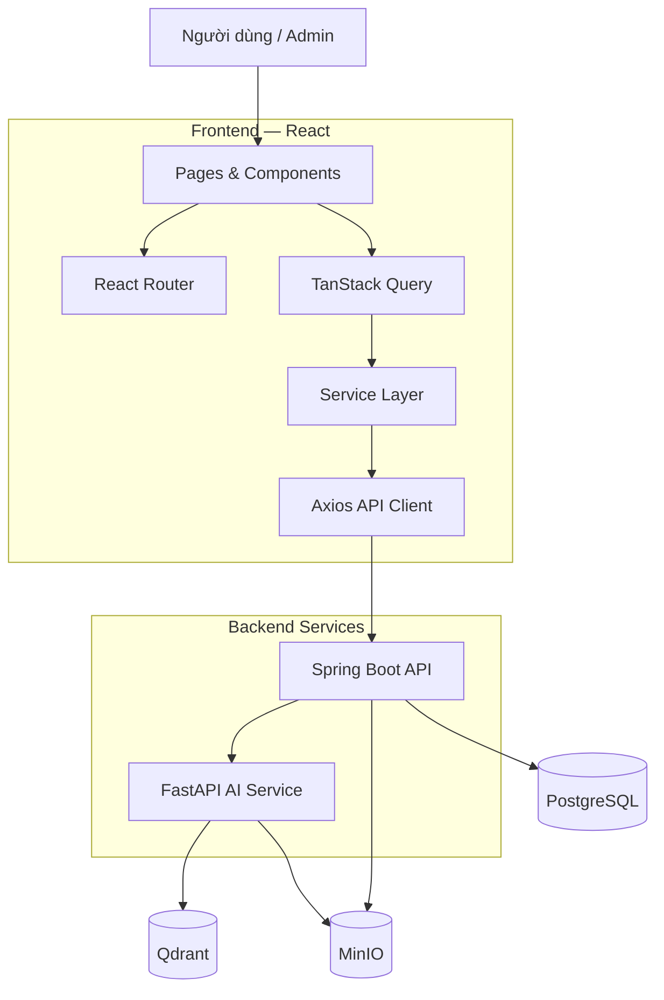
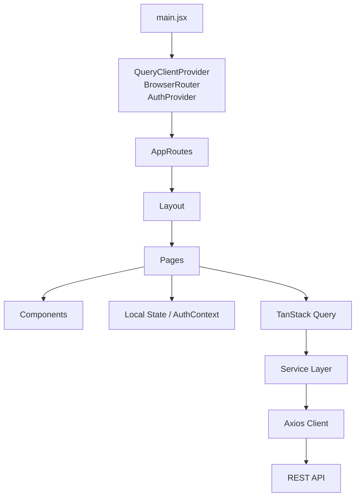
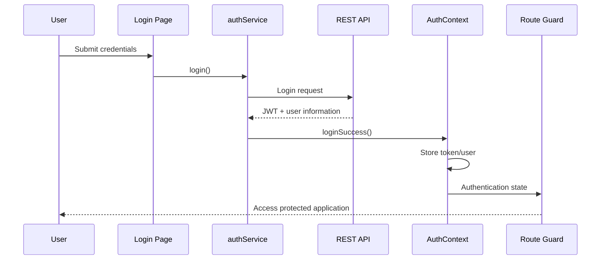
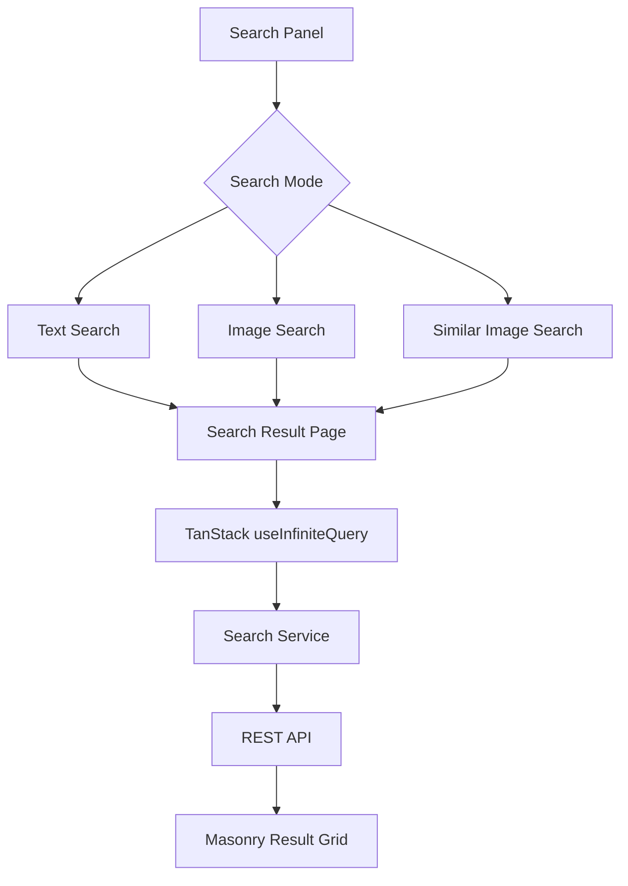
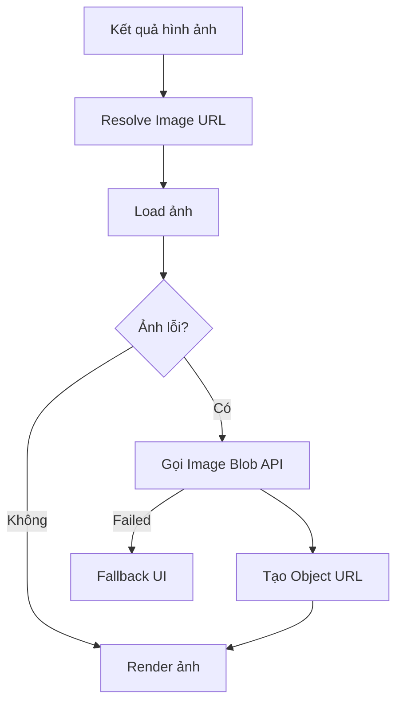

# Visual Search Engine — Frontend

Frontend responsive cho hệ thống Visual Search đa phương thức, hỗ trợ tìm kiếm ngữ nghĩa bằng văn bản, tìm kiếm bằng hình ảnh, tìm kiếm ảnh tương tự, bookmark, lịch sử tìm kiếm và giao diện quản trị cho việc indexing và quản lý hình ảnh.

> **Vai trò:** Frontend Developer  
> **Dự án:** Visual Search Engine  
> **Frontend:** React 19 + Vite 8 + TanStack Query 5 + Tailwind CSS 4

---

## 1. Tổng quan

Visual Search Engine là một ứng dụng web cho phép người dùng tìm kiếm hình ảnh bằng nhiều phương thức khác nhau và quản lý các kết quả tìm kiếm.

Frontend được chia thành hai khu vực chính:

- **Ứng dụng người dùng** — xác thực, tìm kiếm bằng văn bản/hình ảnh, kết quả tìm kiếm, bookmark và lịch sử tìm kiếm.
- **Giao diện quản trị** — dashboard, các job indexing hình ảnh, chi tiết job, thùng rác hình ảnh và quản lý người dùng.

Frontend giao tiếp với backend thông qua REST API. Các request API được tách thành các service module và đi qua Axios client dùng chung, trong khi TanStack Query quản lý server state, cache, mutation, pagination, infinite scroll và polling.

---

## 2. Chức năng

### Người dùng

- Đăng ký và đăng nhập
- Xác thực bằng JWT
- Protected routes
- Route quản trị theo role
- Tìm kiếm ngữ nghĩa bằng văn bản
- Tìm kiếm bằng hình ảnh
- Tìm kiếm ảnh tương tự
- Xem trước và crop ảnh trước khi tìm kiếm
- Infinite scroll cho kết quả tìm kiếm
- Lưới hình ảnh Masonry
- Bookmark hình ảnh
- Thùng rác bookmark và khôi phục
- Lịch sử tìm kiếm
- Xem trước ảnh và zoom
- UI responsive cho desktop và mobile
- Trạng thái loading, error và empty

### Admin

- Dashboard quản trị
- Indexing hình ảnh
- Upload hình ảnh theo batch
- Theo dõi indexing job
- Chi tiết job và trạng thái từng item
- Polling các job đang chạy
- Quản lý thùng rác hình ảnh
- Khôi phục và xoá vĩnh viễn
- Quản lý người dùng
- Giao diện quản trị responsive

---

# 3. System Architecture

Frontend là một thành phần trong hệ thống lớn hơn, bao gồm React application, backend API, AI service, database, vector database và object storage.



The frontend communicates with the backend through the REST API using the `/api/visual-search/v1` base path.

---

# 4. Frontend Architecture

Frontend sử dụng kiến trúc theo từng tầng nhằm tách biệt routing, UI, quản lý state và giao tiếp API.



### Luồng request

```text
Tương tác người dùng
       ↓
Page / Component
       ↓
Local State / AuthContext
       ↓
TanStack Query
       ↓
Service Function
       ↓
Axios API Client
       ↓
REST API
       ↓
Chuẩn hoá response
       ↓
React Query Cache + Local UI State
       ↓
UI Loading / Error / Empty / Data
```

Component không gọi Axios trực tiếp. Các page sử dụng TanStack Query để lấy dữ liệu thông qua service function, trong khi Axios client dùng chung xử lý các cấu hình HTTP như base URL, timeout và JWT interceptor.

---

# 5. Tech Stack

| Technology | Purpose |
|---|---|
| **React 19** | Xây dựng UI theo component |
| **Vite 8** | Development server và build frontend |
| **JavaScript / JSX** | Ngôn ngữ source |
| **Tailwind CSS 4** | Styling và layout responsive |
| **React Router DOM 7** | Routing SPA và route guard |
| **TanStack React Query 5** | Server state, cache, mutation, pagination, infinite query, polling |
| **Axios** | HTTP client và abstraction cho API |
| **React Query Devtools** | Debug query/cache trong môi trường development |
| **React Image Crop** | Crop ảnh trước khi image search |
| **React Intersection Observer** | Trigger infinite scroll |
| **React Masonry CSS** | Layout kết quả ảnh dạng Masonry |
| **SweetAlert2** | Confirmation dialog và feedback người dùng |
| **AOS** | Animation khi scroll |
| **Web Speech API** | Voice input cho text search |
| **Canvas API** | Xử lý crop ảnh |
| **Object URL API** | Preview ảnh local/blob |
| **localStorage / sessionStorage** | Xác thực phía client và state tạm thời |

The frontend source is currently JavaScript/JSX rather than TypeScript.

---

# 6. Project Structure

```text
frontend/
├── public/
├── src/
│   ├── assets/
│   ├── components/
│   │   ├── common/
│   │   └── ui/
│   ├── config/
│   ├── contexts/
│   ├── layouts/
│   ├── mocks/
│   ├── pages/
│   │   └── admin/
│   ├── routes/
│   ├── services/
│   └── utils/
│
├── .env
├── .gitignore
├── Dockerfile
├── nginx.conf
├── package.json
├── package-lock.json
├── vite.config.js
└── README.md
```

### Trách nhiệm của từng thư mục

| Directory | Responsibility |
|---|---|
| `components/common` | Reusable business-oriented components |
| `components/ui` | Shared UI components |
| `config` | Frontend constants and configuration |
| `contexts` | Global client-side state such as authentication |
| `layouts` | User, authentication, and admin application shells |
| `pages` | Page-level components and application flows |
| `routes` | Application routes and route guards |
| `services` | REST API service modules |
| `utils` | Validation, formatting, image URL handling, and helper functions |

---

# 7. Routing

Ứng dụng phân chia route thành khu vực public, user đã đăng nhập và admin.

### Public

```text
/
├── /login
└── /register
```

### Người dùng đã đăng nhập

```text
/search-result
/bookmarks
/bookmarks/trash
/search-history
```

### Admin

```text
/admin
/admin/indexing
/admin/indexing/:jobId
/admin/trash
/admin/users
```

Route protection được xử lý thông qua `ProtectedRoute` và `AdminRoute`.

Route admin yêu cầu người dùng đã đăng nhập phải có role `ADMIN`.

---

# 8. Authentication

Xác thực được quản lý thông qua `AuthContext` và JWT access token.



The Axios client automatically attaches the access token to authenticated requests.

---

# 9. Search Architecture

Trang tìm kiếm hỗ trợ nhiều chế độ tìm kiếm.



### Tìm kiếm bằng văn bản

Thông tin liên quan đến text search được lưu trong URL parameters.

Example:

```text
/search-result?type=text&q=shirt&mode=SEMANTIC&page=1&size=20
```

The search result page reads the parameters and calls the corresponding search service through TanStack Query.

### Tìm kiếm bằng hình ảnh

Luồng image search:

```text
Chọn ảnh
     ↓
Validate file
     ↓
Preview
     ↓
Crop ảnh
     ↓
Canvas → File
     ↓
Temporary Search State
     ↓
Search API
     ↓
Search Results
```

Các định dạng ảnh được hỗ trợ gồm JPG, PNG và WebP, với kích thước upload tối đa 10MB.

### Tìm kiếm ảnh tương tự

Người dùng có thể bắt đầu tìm kiếm ảnh tương tự từ một kết quả tìm kiếm có sẵn.

```text
Search Result
     ↓
Chọn ảnh
     ↓
Similar Image Search
     ↓
imageId
     ↓
Search API
     ↓
Similar Results
```

---

# 10. Search Results & Infinite Scrolling

Kết quả tìm kiếm sử dụng `useInfiniteQuery` của TanStack Query.

```text
Request đầu tiên
      ↓
20 kết quả
      ↓
User cuộn gần cuối
      ↓
Intersection Observer
      ↓
Fetch trang tiếp theo
      ↓
Thêm kết quả
      ↓
Lặp lại
```

The current search page size is:

```text
PAGE_SIZE = 20
```

Cách này giúp tránh việc tải toàn bộ kết quả trong một request.

---

# 11. Kết quả hình ảnh UI

Kết quả tìm kiếm sử dụng Masonry layout vì các hình ảnh có thể có tỉ lệ khác nhau.

```text
┌──────────┐  ┌──────────┐  ┌──────────┐
│          │  │          │  │          │
│  Image   │  │  Image   │  │  Image   │
│          │  │          │  │          │
│          │  └──────────┘  │          │
└──────────┘  ┌──────────┐  │          │
              │          │  └──────────┘
              │  Image   │
              │          │
              └──────────┘
```


---

# 12. Image Loading & Fallback

Frontend không phụ thuộc vào duy nhất một dạng URL hình ảnh.



Utility xử lý image URL có thể:

- Resolve absolute storage URL.
- Chuyển hostname storage nội bộ sang public base URL được cấu hình.
- Tạo object URL từ thông tin storage đã cấu hình.
- Fallback sang image API endpoint bằng `imageId`.

Blob/object URL được revoke khi không còn cần thiết.

---

# 13. Performance

Frontend sử dụng nhiều kỹ thuật để giảm việc render và request mạng không cần thiết.

### Search & List

- TanStack Query caching
- Infinite scrolling
- Pagination
- Intersection Observer
- Lazy loading images

### Component

- Lazy import for search result cards
- Reusable image components
- Shared layouts and components

### Xử lý hình ảnh

- Lazy image loading
- Aspect-ratio preservation
- Blob fallback
- Object URL cleanup

### Upload

Upload hình ảnh ở khu vực admin được chia thành các batch **50 file mỗi request**.

---

# 14. Admin Console

Giao diện admin bao gồm nhiều khu vực quản lý.

## Dashboard

Cung cấp tổng quan về:

- Indexed images
- Users
- Uploaded images
- Processing jobs
- Pending jobs
- Failed jobs
- Indexing progress

## Indexing

```text
Chọn ảnhs
      ↓
Validate
      ↓
Chia thành các batch
      ↓
Upload
      ↓
Tạo Indexing Job
      ↓
Theo dõi Job
      ↓
Hiển thị tiến trình / trạng thái
```

Running jobs are periodically polled to update their status.

## Chi tiết Job

Admin có thể:

- View job information
- View individual items
- Monitor processing status
- Preview images
- Select images
- Perform image actions

## Thùng rác Admin

Hỗ trợ:

- Restore individual images
- Restore selected images
- Restore all
- Permanent deletion
- Image preview

## Quản lý người dùng

Cung cấp:

- User listing
- User status/role information
- Pagination
- Responsive presentation

---

# 15. State Management

Frontend phân tách state dựa trên trách nhiệm của từng loại state.

### Local State

Dùng cho các trạng thái UI tạm thời như:

- Form values
- Search input
- Selected files
- Modal state
- Selected image
- Current UI selections

### Global Client State

`AuthContext` quản lý:

```text
accessToken
user
role
isAuthenticated
loginSuccess
logout
```

### Server State

TanStack Query quản lý:

- Search results
- Bookmarks
- Lịch sử tìm kiếm
- Admin jobs
- Trash
- Users
- Mutations and cache invalidation

Cách phân tách này giúp tránh trộn lẫn server data không cần thiết với local UI state.

---

# 16. API Layer

API layer tuân theo luồng:

```text
Page
  ↓
TanStack Query
  ↓
Service
  ↓
Axios Client
  ↓
REST API
```

Axios client dùng chung chịu trách nhiệm cho các cấu hình HTTP:

- Base URL
- Timeout
- Credentials configuration
- JSON headers
- JWT interceptor
- Multipart/FormData requests

Service modules separate API endpoints by responsibility:

```text
services/
├── authService
├── searchService
├── imageService
├── bookmarkService
├── searchHistoryService
├── adminIndexingService
├── adminTrashService
└── adminUserService
```

Cách này giúp tách chi tiết API khỏi các UI component.

---

# 17. Loading, Error & Empty States

Frontend xử lý rõ ràng các trạng thái khác nhau của ứng dụng thay vì giả định mọi request đều thành công.

### Loading

- Search result skeletons
- Bookmark/history skeletons
- Admin loading states
- Image loading placeholders
- Mutation pending states

### Error

- Lỗi authentication
- Lỗi search
- Lỗi bookmark/history
- Lỗi Admin API
- Lỗi load ảnh

### Empty

- Không search results
- Không bookmarks
- Thùng rác trống
- History trống
- Không jobs

### Confirmation

Các thao tác có tính huỷ dữ liệu như xoá, khôi phục hoặc xoá vĩnh viễn đều có UI xác nhận.

---

# 18. Responsive Design

UI được triển khai bằng các breakpoint của Tailwind CSS.

Các xử lý responsive bao gồm:

- Header responsive
- Navigation trên mobile
- Search result responsive
- Thay đổi số cột Masonry
- Sidebar Admin responsive
- Admin table phù hợp mobile
- Modal preview ảnh responsive
- Layout mobile/desktop cho các trang admin

Mục tiêu là điều chỉnh layout và cách tương tác phù hợp với từng kích thước màn hình, thay vì chỉ thu nhỏ giao diện desktop.

---

# 19. Environment Variables

Frontend sử dụng Vite environment variables để cấu hình theo môi trường.

Example:

```env
VITE_API_BASE_URL=/api/visual-search/v1
VITE_MINIO_PUBLIC_URL=http://localhost:9000
VITE_MINIO_BUCKET=images
```

Không commit credential hoặc secret theo môi trường vào repository.

---

# 20. Getting Started

## Yêu cầu

- Khôngde.js
- npm
- Backend services/API đang chạy

## Cài đặt

```bash
git clone <repository-url>
cd frontend
npm install
```

## Cấu hình Environment

Create a `.env` file:

```env
VITE_API_BASE_URL=/api/visual-search/v1
VITE_MINIO_PUBLIC_URL=http://localhost:9000
VITE_MINIO_BUCKET=images
```

Điều chỉnh các giá trị theo cấu hình backend/storage của môi trường local.

## Chạy Development Server

```bash
npm run dev
```


## Build Production

```bash
npm run build
```

---

# 21. Development Notes

### API request

Tránh gọi Axios trực tiếp bên trong UI component.

Cách sử dụng được khuyến nghị:

```text
Component / Page
      ↓
TanStack Query
      ↓
Service
      ↓
apiClient
```

### Server state

Sử dụng TanStack Query cho dữ liệu đến từ backend.

### Temporary UI state

Sử dụng component state hoặc context khi state cần được chia sẻ hoặc duy trì ở phía client.

### Reusable component

Các component image/search/modal dùng chung nên có khả năng tái sử dụng giữa:

- Search
- Bookmark
- History
- Admin

---


# 24. Key Frontend Engineering Highlights

### 1. Phân tách trách nhiệm

```text
Routes
  ↓
Layouts
  ↓
Pages
  ↓
Components
  ↓
TanStack Query
  ↓
Services
  ↓
Axios
```

### 2. Quản lý server state

TanStack Query được sử dụng thay vì tự điều phối nhiều `useEffect` cho server data.

### 3. UI nhiều hình ảnh

The frontend handles:

- Image upload
- Crop
- Preview
- Lazy loading
- Aspect ratios
- Blob fallback
- Zoom
- Object URL lifecycle

### 4. Xử lý lượng kết quả lớn

Search results use:

```text
20 items/page
+
Infinite Query
+
Intersection Observer
+
Lazy Loading
+
Masonry Layout
```

### 5. Luồng Admin

The admin interface includes asynchronous indexing jobs with:

```text
Upload
  ↓
Tạo Job
  ↓
Polling
  ↓
Tiến trình
  ↓
Chi tiết Job
  ↓
Quản lý hình ảnh
```

---

# 25. Hướng phát triển

Potential next steps for the frontend:

- [ ] Add unit tests
- [ ] Add component/integration tests
- [ ] Introduce TypeScript
- [ ] Add virtualization for large image grids
- [ ] Standardize global error/notification handling
- [ ] Improve accessibility
- [ ] Persist image-search query state
- [ ] Add upload progress indicators
- [ ] Improve image delivery with responsive image sources
- [ ] Add frontend performance profiling
- [ ] Evaluate WebSocket/SSE for real-time admin job updates

---

## 26. Tổng quan kiến trúc project

```text
                    ┌─────────────────────┐
                    │       User          │
                    └──────────┬──────────┘
                               │
                               ▼
                    ┌─────────────────────┐
                    │   React Frontend    │
                    │                     │
                    │ Routes / Layouts    │
                    │ Pages / Components  │
                    └──────────┬──────────┘
                               │
                     ┌─────────┴─────────┐
                     ▼                   ▼
              ┌─────────────┐    ┌─────────────┐
              │ AuthContext │    │ TanStack    │
              │             │    │ Query       │
              └─────────────┘    └──────┬──────┘
                                        │
                                        ▼
                                ┌─────────────┐
                                │  Services   │
                                └──────┬──────┘
                                       │
                                       ▼
                                ┌─────────────┐
                                │    Axios    │
                                └──────┬──────┘
                                       │
                                       ▼
                                ┌─────────────┐
                                │ REST API    │
                                └──────┬──────┘
                                       │
                    ┌──────────────────┼──────────────────┐
                    ▼                  ▼                  ▼
               PostgreSQL           FastAPI             MinIO
                                       │
                                       ▼
                                    Qdrant
```

---

## 27. Thành viên / Vai trò

Đây là project được thực hiện theo nhóm.

**Frontend:** phụ trách React application, kiến trúc UI, tích hợp API, quản lý state, trải nghiệm tìm kiếm, xử lý hình ảnh, responsive design và giao diện admin.

---

## License

Project được thực hiện cho mục đích học tập và phát triển dự án.
